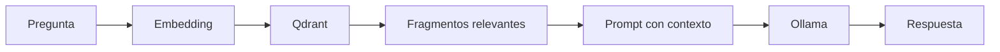
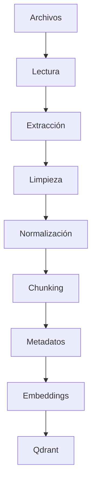
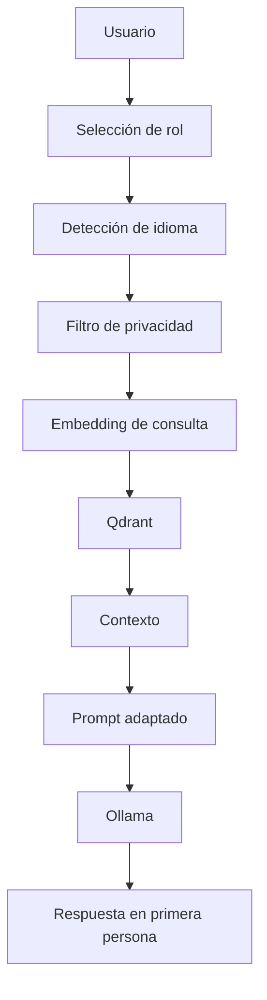

# RAG Personal con Ollama, LlamaIndex y Qdrant

Proyecto pedagógico y profesional para construir un asistente local que responda preguntas sobre Kevin a partir de documentos autorizados, principalmente su hoja de vida y certificaciones en PDF.

La interfaz inicial funciona por consola. El asistente responde en primera persona, detecta el idioma y adapta el tono según el tipo de usuario: reclutador, cliente, estudiante, colega o público general.

> **Regla principal:** si la respuesta no está sustentada en los documentos, el sistema no inventa. Responde: **«Para ampliar esta información, habla directamente con Kevin a través de sus canales oficiales».**

## 1. Objetivo

Construir un sistema de **RAG** (*Retrieval-Augmented Generation* o Generación Aumentada por Recuperación) que:

1. lea documentos locales;
2. limpie y normalice su contenido;
3. lo divida en fragmentos;
4. convierta los fragmentos en vectores;
5. los almacene en Qdrant;
6. recupere el contexto relevante;
7. genere respuestas con un modelo local administrado por Ollama.

## 2. Privacidad

El sistema no debe revelar:

- teléfonos, correos, direcciones ni ubicación exacta;
- datos familiares;
- datos de estudiantes;
- valores de contratos, salarios u honorarios;
- datos privados de clientes, amigos o terceros;
- credenciales, claves, tokens o secretos.

La protección se aplica en tres niveles:

1. **Curación documental:** no se indexa lo que jamás debe compartirse.
2. **Filtro previo:** se bloquean preguntas sensibles.
3. **Prompt de seguridad:** el modelo recibe instrucciones explícitas.

Ningún filtro es perfecto. La defensa principal es no incluir información sensible en `data/raw`.

---

# PARTE I. FUNDAMENTOS

## 3. Inteligencia Artificial

La **Inteligencia Artificial (IA)** es un campo de la informática que construye sistemas capaces de realizar tareas como reconocer patrones, comprender lenguaje, clasificar información o generar contenido.

- **IA basada en reglas:** sigue condiciones escritas por personas.
- **Machine Learning (ML):** aprende patrones a partir de datos.
- **Deep Learning (DL):** usa redes neuronales profundas.
- **IA generativa:** produce texto, imágenes, audio o código.

## 4. Modelo de lenguaje y LLM

Un **modelo de lenguaje** estima qué secuencia de palabras es probable según el contexto.

Un **LLM** significa *Large Language Model* o Modelo de Lenguaje Grande.

Conceptos:

- **Token:** unidad de texto procesada por el modelo.
- **Ventana de contexto:** cantidad máxima de tokens que puede considerar.
- **Inferencia:** ejecución de un modelo ya entrenado.
- **Alucinación:** respuesta convincente pero incorrecta o no sustentada.
- **Temperatura:** controla variabilidad. Para RAG se usa un valor bajo.

## 5. Ollama

Ollama permite descargar, administrar y ejecutar modelos localmente. Proporciona una CLI y una API local, normalmente disponible en:

```text
http://localhost:11434
```

Modelos predeterminados:

```text
Generación: qwen2.5:3b
Embeddings: nomic-embed-text
```

Alternativas ligeras abiertas o de pesos disponibles:

- `qwen3:1.7b`
- `gemma3:1b`
- `llama3.2:1b`

Compruebe disponibilidad y tamaño antes de descargarlos:

```powershell
ollama list
ollama pull NOMBRE_DEL_MODELO
```

## 6. Embeddings

Un **embedding** representa texto mediante un vector numérico:

```text
"gestión de proyectos"
          ↓
[0.12, -0.44, 0.78, ...]
```

Los textos semánticamente parecidos tienden a producir vectores cercanos. El modelo de embeddings no redacta respuestas; sirve para búsqueda semántica.

### Similitud coseno

La similitud coseno mide la orientación entre vectores. Un valor alto indica semejanza matemática, no verdad absoluta.

## 7. Base de datos vectorial

Almacena:

- vectores;
- texto original;
- identificadores;
- metadatos.

Este proyecto usa **Qdrant** porque es abierto, persistente, admite filtros y puede crecer desde modo local hasta servidor.

Alternativas:

| Tecnología | Ventaja | Consideración |
|---|---|---|
| FAISS | Rápida y ligera | No es una base completa |
| Chroma | Simple para prototipos | Menor orientación a crecimiento |
| Qdrant | Persistencia, filtros y escalabilidad | Dependencia especializada |
| Milvus | Escala grande | Más compleja |
| pgvector | Integra vectores con PostgreSQL | Requiere PostgreSQL |
| Weaviate | API completa | Mayor consumo |
| LanceDB | Embebida y ligera | Ecosistema más pequeño |

## 8. LlamaIndex

LlamaIndex conecta datos externos con modelos de lenguaje. En este proyecto coordina:

- carga de archivos;
- creación de documentos y nodos;
- chunking;
- embeddings;
- almacenamiento en Qdrant;
- recuperación;
- construcción del prompt;
- consulta a Ollama.

No reemplaza al modelo ni a la base vectorial. Los integra.

## 9. RAG

RAG significa **Retrieval-Augmented Generation**.



Etapas:

1. **Recuperación:** busca fragmentos relacionados.
2. **Aumento:** agrega esos fragmentos al prompt.
3. **Generación:** el modelo responde usando el contexto.

RAG puede fallar por mala extracción, chunks deficientes, recuperación irrelevante o documentos incorrectos.

## 10. Prompt engineering, RAG y fine-tuning

### Prompt engineering

Diseña instrucciones. No modifica los pesos del modelo.

### Fine-tuning

El **fine-tuning** o ajuste fino continúa el entrenamiento con datos específicos.

Tipos:

- **Full fine-tuning:** modifica gran parte o todos los parámetros.
- **PEFT:** *Parameter-Efficient Fine-Tuning*.
- **LoRA:** *Low-Rank Adaptation*.
- **QLoRA:** LoRA combinado con cuantización para reducir memoria.

| Enfoque | Cambia pesos | Actualización sencilla | Uso |
|---|---:|---:|---|
| Prompt engineering | No | Sí | Instrucciones y formato |
| RAG | No | Sí | Hechos recuperados de documentos |
| Fine-tuning | Sí | Menos sencilla | Estilo o conducta especializada |

Para una hoja de vida actualizable, RAG es más apropiado que fine-tuning.

## 11. Ingestión documental

La **ingestión** es el proceso completo de incorporación de documentos:



## 12. Limpieza documental

Incluye:

- eliminar encabezados o pies repetidos;
- reducir espacios y saltos;
- descartar páginas vacías;
- detectar duplicados;
- normalizar caracteres;
- excluir información sensible;
- revisar errores de extracción.

### OCR

**OCR** significa Reconocimiento Óptico de Caracteres. Se usa para PDFs escaneados. Esta versión no ejecuta OCR automáticamente para evitar errores silenciosos y alto consumo. Los escaneos deben convertirse previamente a PDF con texto.

## 13. Chunking

**Chunking** divide el texto en fragmentos.

- Chunk pequeño: pierde contexto.
- Chunk grande: mezcla temas y aumenta latencia.
- **Overlap:** tokens repetidos entre fragmentos para conservar continuidad.

Configuración inicial:

```env
CHUNK_SIZE=600
CHUNK_OVERLAP=80
```

## 14. Metadatos

Describen cada fragmento:

```json
{
  "file_name": "cv_actualizado.pdf",
  "document_type": "curriculum",
  "source_priority": 100,
  "version": "2026-07"
}
```

Permiten rastrear fuentes, filtrar y priorizar el CV actualizado.

## 15. Versionado

El sistema calcula SHA-256 de cada documento. Si detecta cambios:

1. conserva una copia histórica;
2. reconstruye la colección;
3. actualiza el manifiesto.

Se reconstruye todo el índice por claridad pedagógica y consistencia.

---

# PARTE II. ARQUITECTURA

## 16. Flujo general



## 17. Adaptación de tono

| Rol | Tono |
|---|---|
| Reclutador | Formal, preciso y orientado a competencias |
| Cliente | Comercial y orientado a valor |
| Estudiante | Pedagógico, alegre y explicativo |
| Colega | Técnico y colaborativo |
| Público general | Cercano y profesional |

La fase 1 pregunta el rol. La fase 2 comprobará identidad y permisos.

## 18. Fase 2: autenticación

La siguiente fase limitará el sistema a usuarios registrados.

- **Autenticación:** comprobar quién es.
- **Autorización:** decidir qué puede consultar.
- Contraseñas con hash, nunca en texto plano.
- Roles, permisos, bloqueo por intentos, auditoría y expiración de sesión.

Consulte `docs/FASE_2_AUTENTICACION.md`.

---

# PARTE III. INSTALACIÓN EN WINDOWS

## 19. Requisitos

- Windows 10 u 11.
- Python 3.11 o 3.12.
- Ollama instalado.
- 16 GB de RAM.
- Sin GPU dedicada es posible, pero será más lento.
- Al menos 4 GB libres. Con 10 GB disponibles, vigile el almacenamiento.

## 20. Verificar Ollama

```powershell
ollama --version
ollama list
```

Descargar modelos:

```powershell
ollama pull qwen2.5:3b
ollama pull nomic-embed-text
```

Probar:

```powershell
ollama run qwen2.5:3b
```

Salir:

```text
/bye
```

## 21. Entorno virtual

```powershell
cd ruta\al\repositorio
py -3.12 -m venv .venv
.venv\Scripts\Activate.ps1
```

Si PowerShell bloquea la activación:

```powershell
Set-ExecutionPolicy -Scope Process -ExecutionPolicy Bypass
.venv\Scripts\Activate.ps1
```

## 22. Dependencias

```powershell
python -m pip install --upgrade pip
pip install -r requirements.txt
Copy-Item .env.example .env
```

## 23. Agregar documentos

Coloque documentos autorizados en:

```text
data/raw/
```

Ejemplos:

```text
cv_actualizado.pdf
certificado_pmp.pdf
certificado_ia.pdf
```

## 24. Verificar

```powershell
python -m src.cli check
```

## 25. Ingestar

```powershell
python -m src.cli ingest
```

Reconstrucción forzada:

```powershell
python -m src.cli ingest --rebuild
```

## 26. Conversar

```powershell
python -m src.cli chat
```

Comandos:

```text
/salir
/rol
/debug
```

## 27. Evaluar

```powershell
python -m src.cli evaluate
```

Métricas básicas:

- relevancia por términos esperados;
- rechazo de preguntas sensibles;
- tiempo de respuesta;
- fidelidad revisada manualmente.

---

# PARTE IV. ESTRUCTURA

```text
rag_personal_ollama_llamaindex/
├── README.md
├── requirements.txt
├── .env.example
├── .gitignore
├── data/
│   ├── raw/
│   └── versions/
├── storage/
│   ├── qdrant/
│   └── manifests/
├── src/
│   ├── cli.py
│   ├── config.py
│   ├── documents.py
│   ├── ingest.py
│   ├── privacy.py
│   ├── prompts.py
│   ├── rag.py
│   └── roles.py
├── evaluation/questions.json
├── tests/
├── docs/
└── scripts/setup_windows.ps1
```

## 28. Metodología pedagógica

Aprendizaje Basado en Proyectos:

1. comprender términos;
2. preparar documentos;
3. configurar modelos;
4. ejecutar ingestión;
5. probar recuperación;
6. evaluar respuestas;
7. medir tiempos;
8. construir una interfaz web como deber.

Consulte `docs/EJERCICIOS.md`.

## 29. Limitaciones

- No incluye OCR automático.
- La fase 1 no autentica usuarios.
- La detección de idioma puede fallar con preguntas cortas.
- El filtro de privacidad no reemplaza la curación.
- Los modelos pequeños responden más lento y con menor calidad.
- Una respuesta bien escrita no necesariamente es correcta.

## 30. Referencias oficiales

- [Ollama](https://docs.ollama.com/)
- [Ollama en Windows](https://docs.ollama.com/windows)
- [Embeddings en Ollama](https://docs.ollama.com/capabilities/embeddings)
- [LlamaIndex](https://developers.llamaindex.ai/python/framework/)
- [SimpleDirectoryReader](https://developers.llamaindex.ai/python/framework/module_guides/loading/simpledirectoryreader/)
- [Qdrant con LlamaIndex](https://developers.llamaindex.ai/python/framework/integrations/vector_stores/qdrantindexdemo/)
- [Qdrant](https://qdrant.tech/documentation/)
- [Qdrant Local Quickstart](https://qdrant.tech/documentation/quickstart/)
- [Python](https://www.python.org/downloads/)

## 31. Licencia

Código bajo licencia MIT. Revise por separado las licencias de los modelos y de los documentos indexados.
